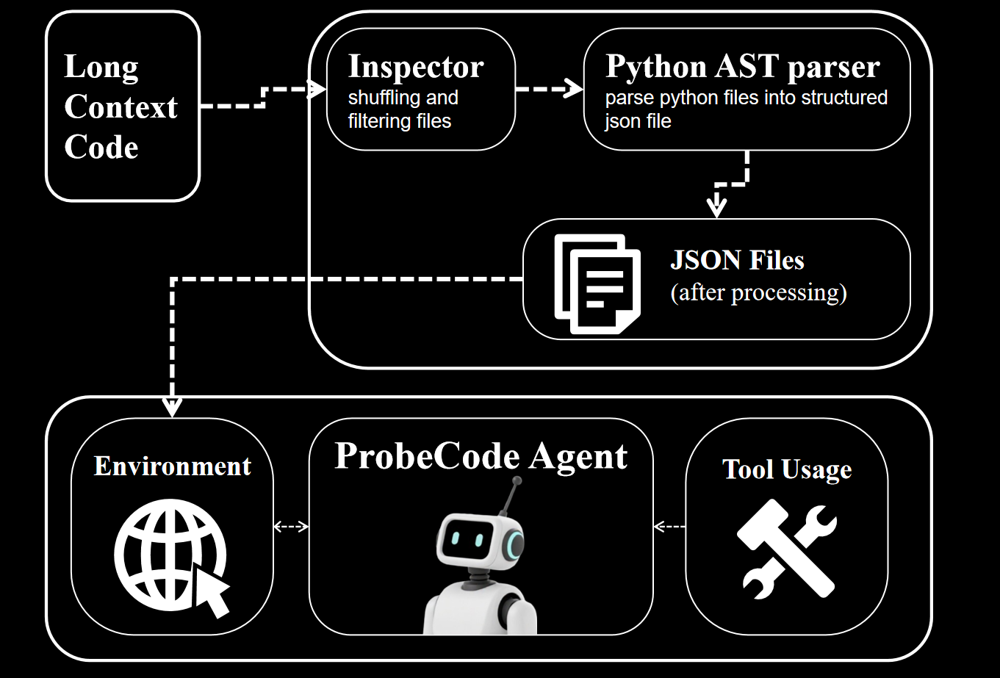

# ProbeCode

AI coding agent integrating static code inspection with a ReAct[^1] framework to understand and memorize long-context code.



> [!IMPORTANT]
> Congratulations! The initial dev release `0.2.0` are available! The current light version (dev) supports a lightweight command-line chat interface with history management and tool calls. See [Usage](#usage) for more detail.

## Introduction

We're developing a **Repo Coding Agent**, named **ProbeCode**, which is designed to operate and comprehend codes at the **project level**. This agent addresses the core challenge of managing extremely long and complex codebases that exceed a typical LLM's context window. It solve this problem by intelligently identifying and reading only the relevant, specialized code sections, which in turn significantly boosts the LLM's comprehension and code generation capabilities for any given problem.

Here are the key features and benefits of our agent:

* **Lightweight CLI:** We support a streamlined command-line interface for conversation, allowing for custom settings and the integration of your own **100% Python-based MCPs (Modularized Code Processors)**.
* **Integrated Tooling and History:** The agent supports powerful tool calls and maintains a history of the conversation, ensuring a coherent and efficient workflow.
* **Unique Long-Context Advantage:** It has a distinct edge in understanding long-form text and code, making it an ideal solution for complex, sprawling projects.
* **More Than a Coding Agent:** By optimizing prompts and providing additional custom MCP resources, our agent can be easily transformed into a powerful AI assistant for various other specialized domains, extending its utility far beyond coding.

<details>

<summary>Current Constructing</summary>

Stage I: We want to let LLM accept the full content for all lines of code of the repository, which can better improve the comprehension of overall code for LLM. ✅

Stage II: Refactor the code & add basic code splitting tools. ✅

Stage III: Integrating more MCP configs and MCP tools for code splitting

- Optimize pyparser and inspector for MCP tools

- build final coding agent pipeline

- Add more MCP configs, including MCP prompt, resources and sampling.

Maybe in the next stage:

- Add frontend components (HTML & CSS & JavaScripts)

See [Todo List](#todo-list) for more information.

</details>

## WorkFlow

- Code Preprocessing
    - Inspector: Inspect files for filtering.
    - Parser: Parse Python files into standard JSON files, which act like the environment with the Agent.
    - This process will finish automatically, all the json file will be stored in `./.environment` folder for future MCP tool calling and reading.

- Chat Process
    - ReAct[^1] Agent Structure: Environment and Reasoning.
    - Enhanced with Tool Usage.
    - Intelligent Agent Memory, supports memory management and compression, including long-term and short-term memory.

- DownStream Applications: More than simple ProbeCode!
    - Purely Python Developing, you can freely add downstream apps.
    - Custom MCP tool definition enhance agent's usage.

## Structure

<details>

<summary>File Structure</summary>

```bash
.
├── CodingAgent
│   ├── __init__.py
│   ├── config.py                   # writing and reading config settings
│   ├── config.yaml                 # config file for permanent settings 
│   ├── inspector                   # inspector module for inspecting code structure
│   │   ├── __init__.py
│   │   └── context_manager.py      
│   ├── llm                         # core component: LLM response with MCP
│   │   ├── __init__.py
│   │   ├── agent                   # basic chatting structure
│   │   │   ├── base_chat.py        # basic chat, including UserChat and BaseChat
│   │   │   ├── client_chat.py      # chat settings for MCPChatBox
│   │   │   └── memory.py           # memory modules for llm response
│   │   ├── config.json             # LLM config settings (model_name, MCP)
│   │   ├── mcp_tool_integrate.py   # scripts for launching MCP tools
│   │   ├── tools                   # MCP tools
│   │   │   ├── file_ops.py         # default MCP tools for file operations
│   │   │   └── web_search.py       # default MCP tools for web search
│   │   └── utils.py
│   ├── main.py                     # main entry part for the programme
│   ├── pyparser                    # independent module: analyzing python code structure
│   │   ├── README.md
│   │   ├── example
│   │   │   └── example.py
│   │   ├── parser.py               # main function for parsing
│   │   ├── result
│   │   │   └── test.json
│   │   └── test
│   │       ├── test_backward_compatibility.py
│   │       └── test_programmatic.py
│   └── utils
│       ├── __init__.py
│       └── logging_info.py         # logger module
├── LICENSE
├── README.md
├── pyproject.toml
├── requirements.txt
├── scripts                         # requirements installation scripts
│   ├── run.sh                      # method with pip
│   └── run_with_uv.sh              # method with uv
└── uv.lock
```

</details>

## Installation

### Requirements

Install several packages with `uv` or `pip`.

```bash
# python >= 3.10
git clone https://github.com/xiyuanyang-code/ProbeCode.git
cd ProbeCode

# install packages
# METHOD1: using uv (recommended)
bash scripts/run_with_uv.sh

# METHOD2: using pip
bash scripts/run.sh
```

### Model Config Settings

- For simple LLM response, we use `Anthropic` for our base model usage, thus `ANTHROPIC_API_KEY` and `ANTHROPIC_BASE_URL` are required.

- For web-search tools, `ZHIPU_API_KEY` is required in environment variables. 

We recommend you to write into your `~/.zshrc` or `~/.bashrc` file.

Several Recommendation:

- How to get your Anthropic API-KEY and base-url?
    - Original Settings: https://api.anthropic.com is the base url and you can get your api-key [here](https://docs.anthropic.com/en/home).

    - For third party proxy platform, I recommend [This platform](https://platform.closeai-asia.com/).

- How to get `ZHIPU_API_KEY` for web search?
    - Go to https://open.bigmodel.cn/usercenter/proj-mgmt/apikeys to generating your own api-key.

> [!Note]
> ZHIPU_API_KEY only support Chinese search for current version, it will be optimized in future versions.

```bash
# write it into ~/.bashrc or ~/.zshrc
export ANTHROPIC_API_KEY="switch to yours"
export ANTHROPIC_BASE_URL="switch to yours"
export ZHIPU_API_KEY="switch to yours"
```

### MCP Settings

Model Name and custom MCP config can be manually defined in [`config.json`](./CodingAgent/llm/config.json)

> [!Note]
> Skip this part for default settings.

<details>

<summary> Custom MCP settings

</summary>

```json
{
    "model": {
        "model_name": [
            "claude-3-5-haiku-20241022",
            "claude-sonnet-4-20250514",
            // you can add more here...
            // the default calling sequence is by index.
        ]
    },
    "servers": {
        "tools": {
            "command": "uv",
            "args": [
                "run",
                "/home/user/CodingAgent/llm/mcp_tool_integrate.py"
            ]
        }
    }
}
```

- If you want to customize your own MCP-tools, write functions and pretty docstring in `./CodingAgent/llm/tools` folder, and MCP server will automatically grasp all the functions and view them as available tools. 

- For Current supported tools, see [this docs](./CodingAgent/llm/tools/README.md).

</details>

## Usage

```bash
# change to your current working directory
probecode

# then enjoy the chat with ProbeCode!
```

After typing the commands above, you can chat with ProbeCode! 

- It will create a file named `.history.txt` which stores all the historical command you have typed in. 

- It will record the dialogue history in 'history' in the original folder (where you clone this project). 

- Logs will be saved here as well (in log in the original folder)

The chat interface supports:
- Multi-turn conversations with context management
- Tool calling via MCP protocol (now supporting file operations and web search for Chinese and English)
- Agent Memory Management
    - Automatic memory compression for long conversations
    - Manual memory storage with the `/memory` command
    - Write history into local files.
- A beautiful CLI UI design.


### DEMO

Now the UI shows like that:


## Contributions

All PRs are welcome. Email the author or raise an issue to communicate how to collaborate in this project.

### Todo List

- [x] Complete the most basic functional design. ✅
- [x] Complete basic file matching, filtering and walking class and util functions. ✅
- [x] Complete the refactoring for the repo code structure for making it available as a python package. ✅
- [x] Complete the basic context management for stage one. ✅
- [x] Complete the model response. ✅
- [x] Couple the two modules and build the final pipeline. ✅
- [x] !REFACTOR: Remove camel. ✅
- [x] !REBUILD: Developing a simple and lightweight LLM multi-turn conversation mini-app with history management. ✅
    - [x] Complete basic model history management ✅
    - [x] Figure out how mainstream LLMs manage history records ✅
    - [x] Add advanced history settings. ✅
- [ ] Module: basic code splitting part constructing
    - [x] Add basic python parser using `ast`. ✅
    - [x] Debug and add more functions for analyzing the tools ✅
    - [x] Integrate this independent modules into pipeline ✅
    - [ ] View this as a MCP tool calling and refactor the code again
- [ ] MCP configuration
    - [x] refactor MCP settings into sandbox
    - [x] Finish MCP tools settings
    - [x] Restrict when LLM are enabled to call tools (optimize docstring)
    - [ ] Finish MCP prompts settings
    - [ ] Finish MCP resources settings
    - [ ] Finish MCP Sampling
    - Relevant Web: [MCP Components](https://huggingface.co/learn/mcp-course/en/unit1/key-concepts)

- [x] Fix: relative file path and using pip to install ✅
    - [x] Make the package can be run in any folder ✅
    - [x] Make the package can be installed with `pip install -e .` ✅
    - [x] Fix the problem for relative file path ✅

## References

[^1]: [React architecture](https://arxiv.org/abs/2210.03629)